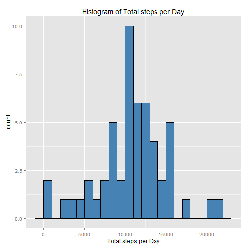
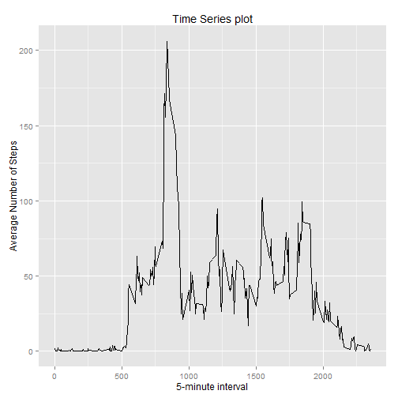
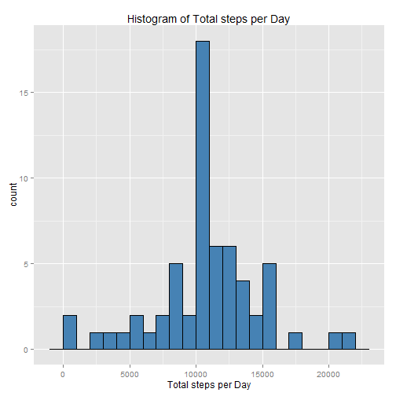

## Loading and preprocessing the data


```r
data <- read.csv("activity.csv", header = T)
```

```
## Warning in file(file, "rt"): cannot open file 'activity.csv': No such file
## or directory
```

```
## Error in file(file, "rt"): cannot open the connection
```

```r
data$date <- as.Date(data$date, format = "%Y-%m-%d")
```

## What is mean total number of steps taken per day?

**Q1: Calculate the total number of steps taken per day**

```r
numOfStepsPerDay <- aggregate(data$steps, by = list(data$date), FUN = "sum")
colnames(numOfStepsPerDay) <- c("Date", "Total_Steps")
```

**Q2: Make a histogram of the total number of steps taken each day**

```r
library(ggplot2)
ggplot(numOfStepsPerDay, aes(Total_Steps)) + 
	geom_histogram(binwidth = 1000, fill = "steelblue", color = "black") +
	labs(title = "Histogram of Total steps per Day", x = "Total steps per Day")
```

 

**Q3: Calculate and report the mean and median of the total number of steps taken per day**
* Mean of the total number of steps taken per day

```r
mean1 <- mean(numOfStepsPerDay$Total_Steps, na.rm = T)
mean1
```

```
## [1] 10766.19
```

* Median of the total number of steps taken per day

```r
median1 <- median(numOfStepsPerDay$Total_Steps, na.rm = T)
median1
```

```
## [1] 10765
```
## What is the average daily activity pattern?
**Q1: Make a time series plot (i.e. type = "l") of the 5-minute interval (x-axis) and the average number of steps taken, averaged across all days (y-axis)**

```r
dataWithOutNAs <- data[!is.na(data$steps), ]

Interval_Means <- aggregate(dataWithOutNAs$steps, by = list(dataWithOutNAs$interval), FUN = mean)
colnames(Interval_Means) <- c("Time_Interval", "Mean_Steps")

ggplot(Interval_Means, aes(x = Time_Interval, y = Mean_Steps)) +
	geom_line() + 
	labs(title = "Time Series plot", x = "5-minute interval", y = "Average Number of Steps")
```

 
**Q2: Which 5-minute interval, on average across all the days in the dataset, contains the maximum number of steps?**

```r
Interval_Means[Interval_Means$Mean_Steps == max(Interval_Means$Mean_Steps), ]$Time_Interval
```

```
## [1] 835
```
## Imputing missing values
**Q1: Calculate and report the total number of missing values in the dataset**

```r
sum(is.na(data$steps))
```

```
## [1] 2304
```

**Q2: Devise a strategy for filling in all of the missing values in the dataset.**
* Strategy : Filling in all of the missing values in the dataset with corresponding Mean for that 5-minute interval.

**Q3: Create a new dataset that is equal to the original dataset but with the missing data filled in.**

```r
New_Data <- data 
for (i in 1:nrow(New_Data)) {
    if (is.na(New_Data$steps[i])) {
        New_Data$steps[i] <- Interval_Means[which(New_Data$interval[i] == Interval_Means$Time_Interval), ]$Mean_Steps
    }
}
```

**Q4: Make a histogram of the total number of steps taken each day and Calculate and report the mean and median total number of steps taken per day.**
* A: Make a histogram of the total number of steps taken each day.

```r
numOfStepsPerDayNoNAs <- aggregate(New_Data$steps, by = list(New_Data$date), FUN = sum)
colnames(numOfStepsPerDayNoNAs) <- c("Date", "Total_Steps")

library(ggplot2)
ggplot(numOfStepsPerDayNoNAs , aes(Total_Steps)) + 
	geom_histogram(binwidth = 1000, fill = "steelblue", color = "black") +
	labs(title = "Histogram of Total steps per Day", x = "Total steps per Day")
```

 
* B: Calculate and report the mean and median total number of steps taken per day.

```r
mean2 <- mean(numOfStepsPerDayNoNAs$Total_Steps)
median2 <- median(numOfStepsPerDayNoNAs$Total_Steps)
```

* C: Do these values differ from the estimates from the first part of the assignment? What is the impact of imputing missing data on the estimates of the total daily number of steps?
 
  Compare the mean and median for before and after imputing missing data:

```r
mean2 - mean1
```

```
## [1] 0
```

```r
median2 - median2
```

```
## [1] 0
```
  The new mean of total steps taken per day is the same as that of the old mean and the new median of total steps taken per day is greater than that of the old median.

## Are there differences in activity patterns between weekdays and weekends?
**Q1: Create a new factor variable in the dataset with two levels – “weekday” and “weekend” indicating whether a given date is a weekday or weekend day.**

```r
New_Data$weekdays <- factor(format(New_Data$date, "%A"))
levels(New_Data$weekdays) <- list(weekday = c("Monday", "Tuesday", "Wednesday", "Thursday", "Friday"),
                                 weekend = c("Saturday", "Sunday"))
levels(New_Data$weekdays)
```

```
## [1] "weekday" "weekend"
```

**Q2: Make a panel plot containing a time series plot (i.e. type = "l") of the 5-minute interval (x-axis) and the average number of steps taken, averaged across all weekday days or weekend days (y-axis).**

```r
AvgSteps <- aggregate(New_Data$steps, 
            list(interval = as.numeric(as.character(New_Data$interval)), weekdays = New_Data$weekdays), FUN = mean)
names(AvgSteps)[3] <- "Mean_Of_Steps"

library(lattice)
xyplot(AvgSteps$Mean_Of_Steps ~ AvgSteps$interval | AvgSteps$weekdays, layout = c(1, 2), type = "l", 
       xlab = "Interval", ylab = "Number of steps")
```

 
